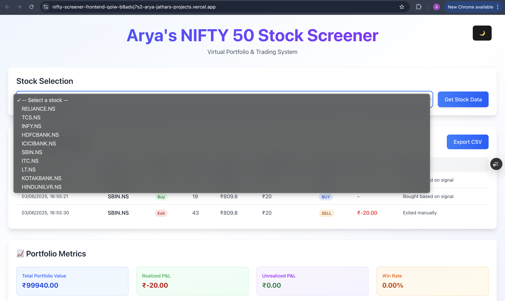

# Arya's NIFTY 50 Stock Screener & Virtual Trading Portfolio Web App

This is a full-stack stock analysis and virtual portfolio simulator web application built using **React.js** and **FastAPI**, focused on the **NIFTY 50** stocks.

It empowers users to:
- Screen stocks using technical indicators
- Generate actionable buy/sell signals
- Execute mock trades with a ₹1,00,000 virtual capital
- Track performance over time using P&L, Sharpe Ratio, Max Drawdown, and more

---

## Tech Stack Used

| Layer       | Technology/Tool                     | Purpose                                  |
|-------------|--------------------------------------|-------------------------------------------|
| **Frontend** | React.js, Tailwind CSS               | UI, dynamic components, styling           |
| **Backend**  | FastAPI (Python)                     | API for fetching live stock data          |
| **Data API** | `yfinance` (Yahoo Finance API)       | Real-time price & historical data         |
| **Deployment** | Vercel (Frontend), Render (Backend) | Hosting live demo                         |
| **Storage** | localStorage (browser)               | Persist capital, portfolio & trade history|

---

##  Key Features & Functionality

### Stock Screener (NIFTY 50)
- Users can select from a dropdown of top 10 NIFTY 50 stocks (customizable)
- Retrieves 20-day historical data using `yfinance`
- Calculates:
  - **9-Day Moving Average (MA)**
  - **14-Day Relative Strength Index (RSI)**

###  Signal Generation Logic
| Condition                          | Signal |
|------------------------------------|--------|
| RSI < 30 **AND** Close > MA        | BUY    |
| RSI > 70 **AND** Close < MA        | SELL   |

Appropriate BUY/SELL actions are displayed based on these signals.

***Actually I replaced AND with OR because I couldn't find stocks which could follow both the conditions and hence came up with this condition***

---

###  Virtual Trading System

- **Starting Capital**: ₹1,00,000
- **Commission**: ₹20 per trade
- **Risk Management**:
  - Max 20% capital per trade
  - Min ₹1,000 required to place an order
- **Order Type**: Market order (executed at current price)

---

###  Portfolio Dashboard

The user portfolio updates in real-time and includes:

| Column         | Description                                         |
|----------------|-----------------------------------------------------|
| Ticker         | Stock symbol                                        |
| Quantity       | Number of shares bought                             |
| Avg. Buy Price | Average cost price per share                        |
| Current Price  | Latest fetched price                                |
| P&L            | Unrealized profit/loss                              |
| Return %       | Percentage return since entry                       |
| Days Held      | Days since purchase                                 |
| Exit           | Allows user to close a position and realize profit  |

---

###  Portfolio Metrics

Real-time portfolio analysis is shown at the bottom:

- 1. **Total Portfolio Value** (capital + unrealized gains)
- 2. **Realized P&L** (from closed trades)
- 3. **Unrealized P&L** (from open positions)
- 4. **Sharpe Ratio** (reward/risk of trades)
- 5. **Max Drawdown** (worst portfolio decline)
- 6. **Win Rate %** (number of profitable exits)
- 7. **Best Performing Stock**
- 8. **Worst Performing Stock**

---

###  Transaction History

Every trade is logged in a clean, paginated table with:

| Field      | Meaning                          |
|------------|----------------------------------|
| Date       | When the trade was executed      |
| Ticker     | Stock traded                     |
| Action     | BUY or EXIT                      |
| Quantity   | Number of shares traded          |
| Price      | Executed price                   |
| Commission | Always ₹20 per trade             |
| Signal     | BUY/SELL reason                  |
| P&L        | Profit or loss                   |
| Notes      | Trade justification              |

---

###  Export to CSV

Users can download:
-  Portfolio as `portfolio.csv`
-  Transaction history as `trade_history.csv`
-  Portfolio metrics as `portfolio_metrics.csv`

Perfect for offline analysis or showcasing.

---

###  Additional UI Features

-  **Dark Mode / Light Mode toggle**
-  Fully responsive for **mobile and desktop**
-  Animations, gradients, and modern UI using **Tailwind CSS**

---

##  How to Use This Website (User Manual)

### 1️⃣ Launch the App

Visit: [Live Site](https://nifty-screener-frontend-qoiw.vercel.app)  
(Frontend deployed on Vercel)

### 2️⃣ Select a Stock

- Choose any stock from the dropdown (e.g., `RELIANCE.NS`)
- Click **"Get Stock Data"**

You’ll see:
- Current Price
- 9-day Moving Average (MA)
- 14-day RSI

---

### 3️⃣ Signal-Based Actions

If signal conditions are met:
- You'll see a **BUY** button (if buy signal is active)
- If already in portfolio, and sell signal is active, the **EXIT** button will be shown

---

### 4️⃣ Trade

- Click **BUY** to purchase shares (based on available capital)
- Click **EXIT** from portfolio table to sell and realize profit/loss

---

### 5️⃣ Track Performance

- Use the **Portfolio section** to see current positions
- Use **Transaction History** for past trades
- Use **Metrics panel** to view performance insights

---

### 6️⃣ Export Reports

Click export buttons to download data as CSV:
- Portfolio
- Trade History
- Portfolio Metrics

---

## SCREENSHOTS:

###  Stock Selection

###  Buy Signal Triggered

### 💼 Portfolio Table

###  Transaction History

###  Portfolio Metrics

###  Dark Mode

###  Excel report of transaction history

##  Author & Credits

**Arya Jathar**  
Built this app by integrating React + FastAPI with the help of ChatGPT & Claude.  
Strives to understand all components, calculations, and design decisions made during the production and deployment of this website.

